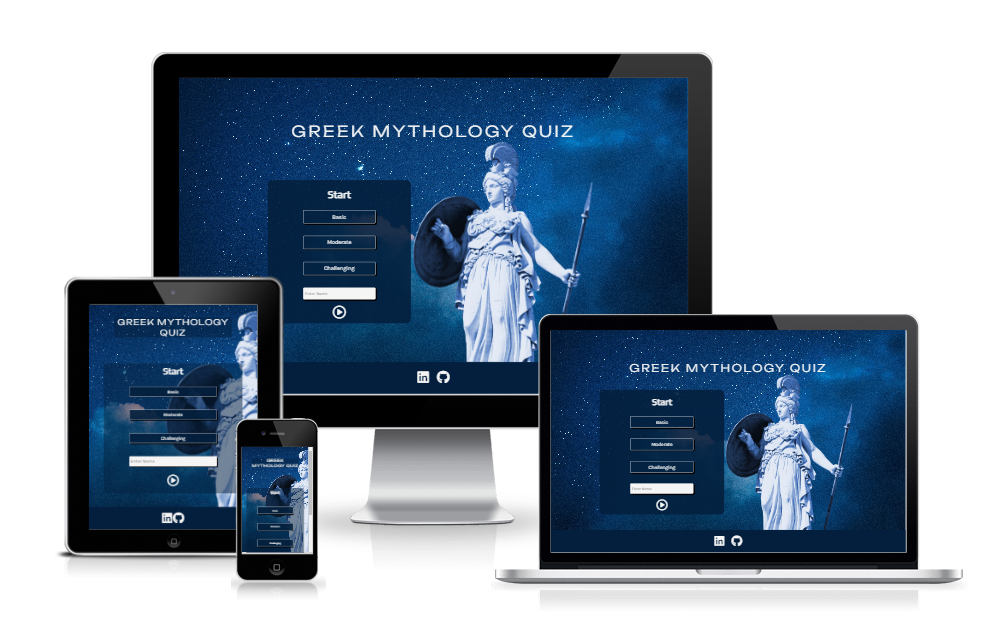

# **Greek Mythology Quiz - Project Portfolio 2 - JavaScript**

"Greek Mythology Quiz" is and online quiz for anyone curious to test their knowledge or learn more about Greek Mythology. Player can choose the question difficulty from three cathegories: basic, moderate and chanllenging. 

Once the player has entered a name and chosen a question cathegory, they can click the play button and the game will start. Quiz consists of 5 questions that are generated randomly from the chosen difficulty pool. Each question will be given 3 answer options. Each right answer will increase the points. More difficult the question, more point it generates.

Once the quiz is over the player will be given the final score and a choice to play again. Game can be played multiple times as questions are always generated randomly.

Link to the quiz is [here.](https://hmuraja.github.io/mythology-quiz/)

# Features

## Header
Contains the title of the game, this also acts as a "homing" button. This title is always visible and can be clicked at any point and it will return the user to the beginning of the game.

## Start Window
Start window is visible first thing when page is loaded. Start window has a title "start" and 3 buttons presenting the three difficulty levels to choose from. Player is requested to enter their name in the field stating "Enter name" andthe play button on the bottom of the window starts the game. Game can only be started after name and difficulty levels have been chosen.

## Question Window
Once play button is pressed th efirst questioin is displayed on the question window.This window has three sections: top, middle and bottom. Top section indicates the question number that the player is currently on. 

Middle part has the question and three clickable answer buttons.Once an answer has been selected, a green tick will appear next to the correct answer button. If player has chosen wrong answer a red "x" icon will display next to the selection.  

Bottom section displays the score player has accumulated and a "move-on" button. Move on button displays only after one of the answer options has been selected. Move-on button is an arrow button that displays the next question once clicked, once all 5 questions have been exhausted, button will change into a checkered flag. This button will display the finish window once clicked.

  

## Finish Window
This is the last wndow of the game and states "Finish!" at the top, the score in the middle and and return arrow at the bottom. Score displayes is a sum of all the points gotten from the quiz. Once the return button, which is a circling arrow, is clicked it will return the the start window to the view. A new game is started just like explained in the beginning.

## Footer

Footer has two links: one to this projects GitHub page and to the authors Linkedin profile.

# Testing

## HTML Validator
The Official W3C validator for HTML was ran twice. On the initial run, 4 misuses of Aria-labels where flagged. Aria-labels were removed or replaced more appropriate attribute. On the second run no errors occurred.

## CSS Validator
The Official Jigsaw validator for CSS validator was ran twice. First run came uo with one error which was related to incorrect value. Error was corrected and no further errors were detected the second time around. There were few warning about use of external vendors used to  control the background image. 

## JS Validator
The official Jshint validator for JS was ran twice for the script.js. First time round there was no errors, but warnings and unrecognized variables were noted. Most of the warnings were related to use of "let" and "const" keywords with version ES6. Similar warnings were flagged around the use of template literals. These might cause an issue if older browser types are used.

From the undeclared variables 2 cases were corrected, just by adding a simple declaration. Few variables were unrecognized as they originated from another js file, a comment was added for clarification. 
A semicolon was noted to be missing from one line, and another line had excess one, both were corrected. 
A for loop was missing a variable declaration. Declaration added to the loop.

The scrip.js was ran through the validator for the second time after changes and no new warnings were noted. 

Following metrics were returned:
  * There are 15 functions in this file
  * Function with the largest signature take 1 arguments, while the median is 0.
  * Largest function has 23 statements in it, while the median is 5.
  * The most complex function has a cyclomatic complexity value of 6 while the median is 1.

When question.js was ran throuigh the validator, no errors or significant warnings were noted. No metrics were provided for thsi file. 

## Screen sizes
Quiz was ran on all available viewports on Chrome Developer Tools and deemed to be responsive on all of them. 

## Bugs
No unresolved bugs were detected during testing. 

## Deployement History

# Credits

## Code
All code has been written by Hilla Muraja, unless stated otherwise. If code has been takne elsewhere, it has been clearly stated in in content section or in the section below.

- Radio buttons circles were removed and replaced with the label text by using the code found from [markheat.net](https://markheath.net/post/customize-radio-button-css) website.
- Changed start game pages submit button to icon button using the code with alteration from [stackoverflow](https://stackoverflow.com/questions/30837216/replacing-submit-buttons-with-icon-basics).
- Background was made responsive for all screensizes by using this code taken from [here.](https://css-tricks.com/perfect-full-page-background-image/ )

## Resources
Sources for troubleshooting:
 - [W3Schools](https://www.w3schools.com/)
 - [Code Institutes Course Material](https://codeinstitute.net/)

[Gimp 2](https://www.gimp.org/downloads/) was used to modify images used in this project.

## Content and Media
- Questions for this quiz were taken from [trivialbliss.](https://triviabliss.com/categories/greek-mythology/) and from book Mythos authored by Stephen Fry.
- Icons where taken from [fontawesome.](www.fontawesome.com)
- All images have been taken from [pexels.](https://www.pexels.com/)
- Fonts are from [Google Fonts.](https://fonts.google.com/)
